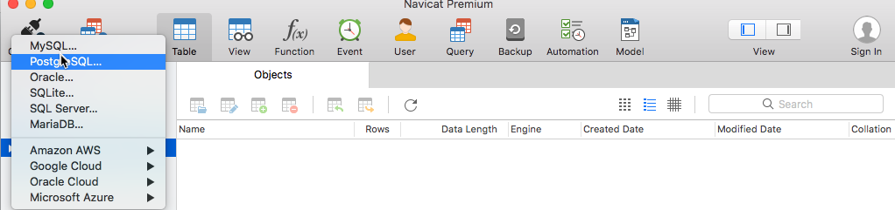
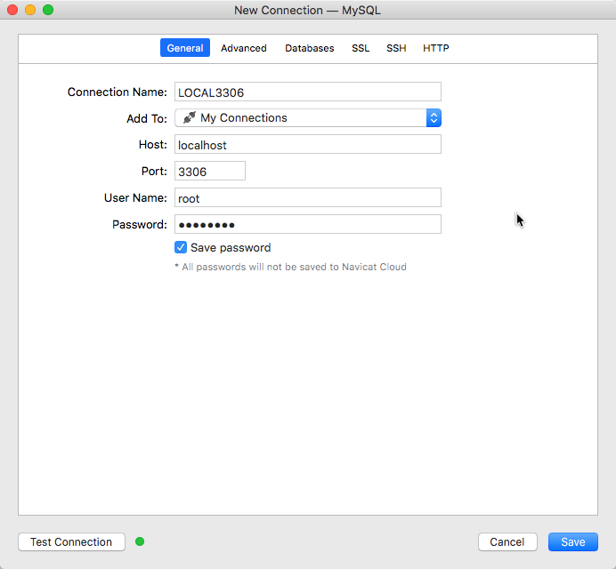
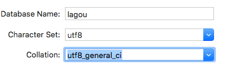
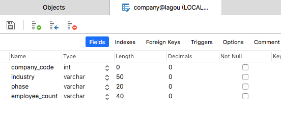
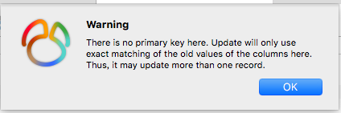
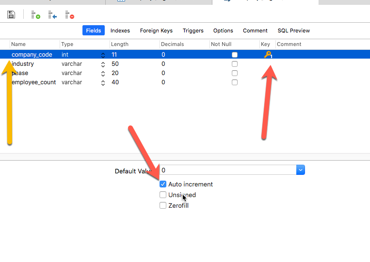
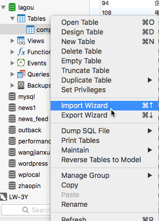
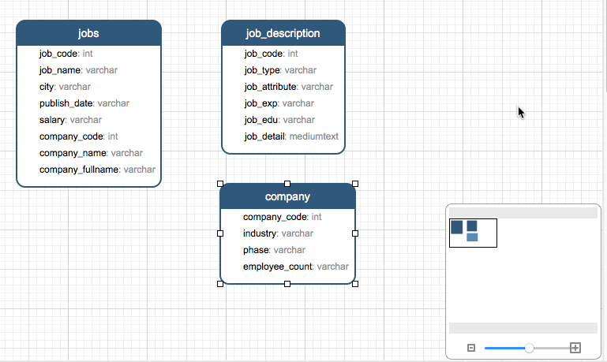
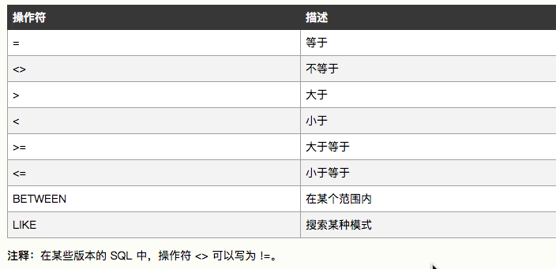

# MySQL 基本操作


## 1. 启动 MySQL 服务


## 2. 打开 Navicat



## 3. 连接数据库

左上角 连接

LOCAL3306

localhost
3306
root
*****



## 4. 创建数据库



## 5. 创建 Table


company_code    industry    phase   employee_count
int varchar(50) varchar(20) varchar(40)








## 6. 导入



## 7. ER




## 8. 公司是 A 轮的在成都招聘的岗位的描述信息

``` sql


SELECT * FROM company,jobs,job_description where company.phase like '%A轮%' and jobs.city='成都' and company.company_code = jobs.company_code and jobs.job_code = job_description.job_code

```

## 9. 查询数据库中关于融资进度的描述

```sql

SELECT distinct phase FROM company

```

## 10. where 条件



## 11. order by

asc 升序  desc 降序

## 12. insert

```sql

INSERT INTO `company` VALUES (38, '移动互联网', 'A轮', '50-150人');

```

company  ： company_code company_name phase employee_count


如果 values 后面是对应列数的个数，前面可以省略，要不然，就必须一一对应


INSERT INTO `company`(company_code,phase,company_name) 
values(37,'A轮','');


## 13. update

```sql

UPDATE 表名称 SET 列名称 = 新值 WHERE 列名称 = 某值

```

## 按照发布职位数倒序排列，显示公司名和发布的职位数

```sql

SELECT company_name,count(*) as counts FROM jobs GROUP BY company_code  order by counts desc

```

---

## 14. JOIN


## 一．Join语法概述

join 用于多表中字段之间的联系，语法如下：

```hljs
... FROM table1 INNER|LEFT|RIGHT JOIN table2 ON conditiona
```

table1:左表；table2:右表。

JOIN 按照功能大致分为如下三类：

INNER JOIN（内连接,或等值连接）：取得两个表中存在连接匹配关系的记录。

LEFT JOIN（左连接）：取得左表（table1）完全记录，即是右表（table2）并无对应匹配记录。

RIGHT JOIN（右连接）：与 LEFT JOIN 相反，取得右表（table2）完全记录，即是左表（table1）并无匹配对应记录。

注意：**mysql不支持Full join**,不过可以通过UNION 关键字来合并 LEFT JOIN 与 RIGHT JOIN来模拟FULL join.

接下来给出一个列子用于解释下面几种分类。如下两个表(A,B)

```hljs
mysql> select A.id,A.name,B.name from A,B where A.id=B.id;
+----+-----------+-------------+
| id | name       | name             |
+----+-----------+-------------+
|  1 | Pirate       | Rutabaga      |
|  2 | Monkey    | Pirate            |
|  3 | Ninja         | Darth Vader |
|  4 | Spaghetti  | Ninja             |
+----+-----------+-------------+
4 rows in set (0.00 sec)
```

## 二.Inner join

内连接，也叫等值连接，inner join产生同时符合A和B的一组数据。

```hljs
mysql> select * from A inner join B on A.name = B.name;
+----+--------+----+--------+
| id | name   | id | name   |
+----+--------+----+--------+
|  1 | Pirate |  2 | Pirate |
|  3 | Ninja  |  4 | Ninja  |
+----+--------+----+--------+
```


## 三.Left join

```hljs
mysql> select * from A left join B on A.name = B.name;
#或者：select * from A left outer join B on A.name = B.name;

+----+-----------+------+--------+
| id | name      | id   | name   |
+----+-----------+------+--------+
|  1 | Pirate    |    2 | Pirate |
|  2 | Monkey    | NULL | NULL   |
|  3 | Ninja     |    4 | Ninja  |
|  4 | Spaghetti | NULL | NULL   |
+----+-----------+------+--------+
4 rows in set (0.00 sec)
```

left join,（或**left outer join:在Mysql中两者等价，推荐使用left join.**）左连接从左表(A)产生一套完整的记录,与匹配的记录(右表(B)) .如果没有匹配,右侧将包含null。


如果想只从左表(A)中产生一套记录，但不包含右表(B)的记录，可以通过设置where语句来执行，如下：

```hljs
mysql> select * from A left join B on A.name=B.name where A.id is null or B.id is null;
+----+-----------+------+------+
| id | name      | id   | name |
+----+-----------+------+------+
|  2 | Monkey    | NULL | NULL |
|  4 | Spaghetti | NULL | NULL |
+----+-----------+------+------+
2 rows in set (0.00 sec)
```


同理，还可以模拟inner join. 如下：

```hljs
mysql> select * from A left join B on A.name=B.name where A.id is not null and B.id is not null;
+----+--------+------+--------+
| id | name   | id   | name   |
+----+--------+------+--------+
|  1 | Pirate |    2 | Pirate |
|  3 | Ninja  |    4 | Ninja  |
+----+--------+------+--------+
2 rows in set (0.00 sec)
```

**求差集：**

根据上面的例子可以求差集，如下：

```hljs
SELECT * FROM A LEFT JOIN B ON A.name = B.name
WHERE B.id IS NULL
union
SELECT * FROM A right JOIN B ON A.name = B.name
WHERE A.id IS NULL;
# 结果
    +------+-----------+------+-------------+
| id   | name      | id   | name        |
+------+-----------+------+-------------+
|    2 | Monkey    | NULL | NULL        |
|    4 | Spaghetti | NULL | NULL        |
| NULL | NULL      |    1 | Rutabaga    |
| NULL | NULL      |    3 | Darth Vader |
+------+-----------+------+-------------+
```


## 四.Right join

```hljs
mysql> select * from A right join B on A.name = B.name;
+------+--------+----+-------------+
| id   | name   | id | name        |
+------+--------+----+-------------+
| NULL | NULL   |  1 | Rutabaga    |
|    1 | Pirate |  2 | Pirate      |
| NULL | NULL   |  3 | Darth Vader |
|    3 | Ninja  |  4 | Ninja       |
+------+--------+----+-------------+
4 rows in set (0.00 sec)
```

同left join。

## 五.Cross join

cross join：交叉连接，得到的结果是两个表的乘积，即[笛卡尔积](http://baike.baidu.com/view/348542.htm?fromtitle=%E7%AC%9B%E5%8D%A1%E5%B0%94%E7%A7%AF&fromid=1434391&type=syn)

> 笛卡尔（Descartes）乘积又叫直积。假设集合A={a,b}，集合B={0,1,2}，则两个集合的笛卡尔积为{(a,0),(a,1),(a,2),(b,0),(b,1), (b,2)}。可以扩展到多个集合的情况。类似的例子有，如果A表示某学校学生的集合，B表示该学校所有课程的集合，则A与B的笛卡尔积表示所有可能的选课情况。

```hljs
mysql> select * from A cross join B;
+----+-----------+----+-------------+
| id | name      | id | name        |
+----+-----------+----+-------------+
|  1 | Pirate    |  1 | Rutabaga    |
|  2 | Monkey    |  1 | Rutabaga    |
|  3 | Ninja     |  1 | Rutabaga    |
|  4 | Spaghetti |  1 | Rutabaga    |
|  1 | Pirate    |  2 | Pirate      |
|  2 | Monkey    |  2 | Pirate      |
|  3 | Ninja     |  2 | Pirate      |
|  4 | Spaghetti |  2 | Pirate      |
|  1 | Pirate    |  3 | Darth Vader |
|  2 | Monkey    |  3 | Darth Vader |
|  3 | Ninja     |  3 | Darth Vader |
|  4 | Spaghetti |  3 | Darth Vader |
|  1 | Pirate    |  4 | Ninja       |
|  2 | Monkey    |  4 | Ninja       |
|  3 | Ninja     |  4 | Ninja       |
|  4 | Spaghetti |  4 | Ninja       |
+----+-----------+----+-------------+
16 rows in set (0.00 sec)

#再执行：mysql> select * from A inner join B; 试一试

#在执行mysql> select * from A cross join B on A.name = B.name; 试一试
```

实际上，**在 MySQL 中（仅限于 MySQL） CROSS JOIN 与 INNER JOIN 的表现是一样的**，在不指定 ON 条件得到的结果都是笛卡尔积，反之取得两个表完全匹配的结果。  
INNER JOIN 与 CROSS JOIN 可以省略 INNER 或 CROSS 关键字，因此下面的 SQL 效果是一样的：

```hljs
... FROM table1 INNER JOIN table2
... FROM table1 CROSS JOIN table2
... FROM table1 JOIN table2
```

## 六.Full join

```hljs
mysql> select * from A left join B on B.name = A.name 
    -> union 
    -> select * from A right join B on B.name = A.name;
+------+-----------+------+-------------+
| id   | name      | id   | name        |
+------+-----------+------+-------------+
|    1 | Pirate    |    2 | Pirate      |
|    2 | Monkey    | NULL | NULL        |
|    3 | Ninja     |    4 | Ninja       |
|    4 | Spaghetti | NULL | NULL        |
| NULL | NULL      |    1 | Rutabaga    |
| NULL | NULL      |    3 | Darth Vader |
+------+-----------+------+-------------+
6 rows in set (0.00 sec)
```

全连接产生的所有记录（双方匹配记录）在表A和表B。如果没有匹配,则对面将包含null。


## 七.性能优化

### 1.显示(explicit) inner join VS 隐式(implicit) inner join

如：

```hljs
select * from
table a inner join table b
on a.id = b.id;
```

VS

```hljs
select a.*, b.*
from table a, table b
where a.id = b.id;
```

我在数据库中比较(10w数据)得之，它们用时几乎相同，第一个是显示的inner join，后一个是隐式的inner join。

[**参照:Explicit vs implicit SQL joins**](http://stackoverflow.com/questions/44917/explicit-vs-implicit-sql-joins)

### 2.left join/right join VS inner join

尽量用inner join.避免 LEFT JOIN 和 NULL.

在使用left join（或right join）时，应该清楚的知道以下几点：

#### (1). on与 where的执行顺序

> ON 条件（“A LEFT JOIN B ON 条件表达式”中的ON）用来决定如何从 B 表中检索数据行。如果 B 表中没有任何一行数据匹配 ON 的条件,将会额外生成一行所有列为 NULL 的数据,**在匹配阶段 WHERE 子句的条件都不会被使用。仅在匹配阶段完成以后，WHERE 子句条件才会被使用。它将从匹配阶段产生的数据中检索过滤。**

所以我们要注意：**在使用Left (right) join的时候，一定要在先给出尽可能多的匹配满足条件，减少Where的执行。**如：

**PS, 这部分有些不妥，感谢 wxweven 指正**：

> 这部分的内容，博主写的有些欠妥当，不知道博主有没有实际运行测试过，下面说说我的看法：

> （1）首先关于on和where的用法，如果直接把where里面的条件拿到on里面去，结果是跟原来的不一致的，所以博主说的“在使用Left (right) join的时候，一定要在先给出尽可能多的匹配满足条件，减少Where的执行”是不成立的，因为筛选条件放在on或者where，产生的是不同的结果，不能说为了性能就把where中的条件放到on中。

## 可参考[sql语句中join on和where用法的区别和联系](https://my.oschina.net/jun24bryant/blog/787375)

PASS

```hljs
select * from A
inner join B on B.name = A.name
left join C on C.name = B.name
left join D on D.id = C.id
where C.status>1 and D.status=1;
```

Great

```hljs
select * from A
inner join B on B.name = A.name
left join C on C.name = B.name and C.status>1
left join D on D.id = C.id and D.status=1
```

从上面例子可以看出，尽可能满足ON的条件，而少用Where的条件。从执行性能来看第二个显然更加省时。

#### (2).注意ON 子句和 WHERE 子句的不同

如作者举了一个列子：

```hljs
mysql> SELECT * FROM product LEFT JOIN product_details
       ON (product.id = product_details.id)
       AND product_details.id=2;
+----+--------+------+--------+-------+
| id | amount | id   | weight | exist |
+----+--------+------+--------+-------+
|  1 |    100 | NULL |   NULL |  NULL |
|  2 |    200 |    2 |     22 |     0 |
|  3 |    300 | NULL |   NULL |  NULL |
|  4 |    400 | NULL |   NULL |  NULL |
+----+--------+------+--------+-------+
4 rows in set (0.00 sec)

mysql> SELECT * FROM product LEFT JOIN product_details
       ON (product.id = product_details.id)
       WHERE product_details.id=2;
+----+--------+----+--------+-------+
| id | amount | id | weight | exist |
+----+--------+----+--------+-------+
|  2 |    200 |  2 |     22 |     0 |
+----+--------+----+--------+-------+
1 row in set (0.01 sec)
```

> 从上可知，第一条查询使用 ON 条件决定了从 LEFT JOIN的 product_details表中检索符合的所有数据行。第二条查询做了简单的LEFT JOIN，然后使用 WHERE 子句从 LEFT JOIN的数据中过滤掉不符合条件的数据行。

#### (3).尽量避免子查询，而用join

往往性能这玩意儿，更多时候体现在数据量比较大的时候，此时，我们应该避免复杂的子查询。如下：

PASS

```hljs
insert into t1(a1) select b1 from t2 where not exists(select 1 from t1 where t1.id = t2.r_id);
```

Great

```hljs
insert into t1(a1)  
select b1 from t2  
left join (select distinct t1.id from t1 ) t1 on t1.id = t2.r_id   
where t1.id is null;
```

这个可以参考[mysql的exists与inner join 和 not exists与 left join 性能差别惊人](http://openxtiger.iteye.com/blog/1911228)

### 补充：MySQL STRAIGHT_JOIN 与 NATURAL JOIN的使用

感谢网友[\** 折翼的鸟**](http://www.cnblogs.com/toxiaonan/) 给出的提醒。

长话短说：straight_join实现强制多表的载入顺序，从左到右，如：

```hljs
...A straight_join B on A.name = B.name
```

straight_join完全等同于inner join 只不过，join语法是根据“哪个表的结果集小，就以哪个表为驱动表”来决定谁先载入的，而straight_join 会强制选择其左边的表先载入。

往往我们在分析mysql处理性能时，如(Explain),如果发现mysql在载入顺序不合理的情况下，可以使用这个语句，但往往mysql能够自动的分析并处理好。

更多内容参考：[MySQL STRAIGHT_JOIN 与 NATURAL JOIN](http://www.5idev.com/p-php_mysql_straight_join_natural_join.shtml)  
和[MySQL优化的奇技淫巧之STRAIGHT_JOIN](http://huoding.com/2013/06/04/261)


## SELECT INTO

```sql


INSERT INTO `full_company`
SELECT
    DISTINCT jobs.company_code,
    jobs.company_name,
    jobs.company_fullname,
    company.phase,
    company.employee_count,
    company.industry 
FROM
    jobs
    LEFT JOIN company ON jobs.company_code = company.company_code


```
## MYSQL - SELECT INTO


### 一.简介<br>

Insert是T-sql中常用语句，Insert INTO table(field1,field2,...) values(value1,value2,...)这种形式的在应

用程序开发中必不可少。 

但我们在开发、测试过程中，经常会遇到需要表复制的情况，如将一个table1的数据的部分字段复制到

table2中，或者将整个table1复制到table2中，这时候我们就要使用select into  from和 insert into select 表复制语句了。

### 二.方式1（常用）：insert into select

1、语句形式：

```hljs
Insert into Table2(field1,field2,...) select value1,value2,... from Table1
```

2、要求：

目标表Table2必须存在；

由于目标表Table2已经存在，所以我们除了插入源表Table1的字段外，还可以插入常量；

3、例子：

```hljs
--1.创建测试表 
    create TABLE Table1 
    ( 
        a varchar(10), 
        b varchar(10), 
        c varchar(10), 
        CONSTRAINT [PK_Table1] PRIMARY KEY CLUSTERED 
        ( 
            a ASC 
        ) 
    ) ON [PRIMARY] 
    create TABLE Table2 
    ( 
        a varchar(10), 
        c varchar(10), 
        d int, 
        CONSTRAINT [PK_Table2] PRIMARY KEY CLUSTERED 
        ( 
            a ASC 
        ) 
    ) ON [PRIMARY] 
    GO 
    --2.创建测试数据 
    Insert into Table1 values('赵','asds','90') 
    Insert into Table1 values('钱','asds','100') 
    Insert into Table1 values('孙','asds','80') 
    Insert into Table1 values('李','asds',null) 
    GO 
    select * from Table2 
    --3.INSERT INTO SELECT语句复制表数据 
    Insert into Table2(a, c, d) select a,c,5 from Table1 
    GO 
    --4.显示更新后的结果 
    select * from Table2 
    GO 
    --5.删除测试表 
    drop TABLE Table1 
    drop TABLE Table2
```

也可参考一下sql：

```hljs
INSERT INTO `um_region`(`region_id`,`parent_id`,`name`,`sort`,`type`)
SELECT `region_id`,`parent_id`,`name`,`sort`,`type` FROM `省$`
```

### 三.方式2：select into from

1、语句形式：

```hljs
SELECT vale1, value2 into Table2 from Table1
```

2、要求：

目标表Table2不存在；

因为在插入时会自动创建表Table2，并将Table1中指定字段数据复制到Table2中。

3、例子：

```hljs
--1.创建测试表 
    create TABLE Table1 
    ( 
        a varchar(10), 
        b varchar(10), 
        c varchar(10), 
        CONSTRAINT [PK_Table1] PRIMARY KEY CLUSTERED 
        ( 
            a ASC 
        ) 
    ) ON [PRIMARY] 
    GO 
    --2.创建测试数据 
    Insert into Table1 values('赵','asds','90') 
    Insert into Table1 values('钱','asds','100') 
    Insert into Table1 values('孙','asds','80') 
    Insert into Table1 values('李','asds',null) 
    GO 
    --3.SELECT INTO FROM语句创建表Table2并复制数据 
    select a,c INTO Table2 from Table1 
    GO 
    --4.显示更新后的结果 
    select * from Table2 
    GO 
    --5.删除测试表 
    drop TABLE Table1 
    drop TABLE Table2
```

### 四.是否复制表结构、数据到新表

#### 1、复制表结构以及数据

```hljs
CREATE TABLE 新表  
SELECT * FROM 旧表
```

#### 2、只复制表结构

a、      CREATE TABLE 新表  

SELECT * FROM 旧表 WHERE 1=2

即:让WHERE条件不成立.  
b、:(低版本的mysql不支持，mysql4.0.25 不支持，mysql5已经支持了)  
CREATE TABLE 新表  
LIKE 旧表

#### 3、复制旧表数据到新表（两表结构一样）

```hljs
INSERT INTO 新表
    SELECT * FROM 旧表
```

#### 4、复制旧表数据到新表（两表结构不一样）<br>

```hljs
INSERT INTO 新表(字段1,字段2,…….)
     SELECT 字段1,字段2,…… FROM 旧表
```


## 16. MySQL 函数的使用


```sql


SELECT
    jobs.job_name,
    REPLACE(REPLACE(REPLACE(substring_index( jobs.salary, '-', 1 ),'k',''),'以上',''),'K','') AS min_salary,
    REPLACE(REPLACE(REPLACE(substring_index( jobs.salary, '-', -1 ),'k',''),'以上',''),'K','') AS max_salary 
FROM
    jobs


```

更新 jobs 表里所有的数据


```sql


UPDATE jobs set min_salary = REPLACE(REPLACE(REPLACE(substring_index( jobs.salary, '-', 1 ),'k',''),'以上',''),'K',''),max_salary=REPLACE(REPLACE(REPLACE(substring_index( jobs.salary, '-', -1 ),'k',''),'以上',''),'K','')

```