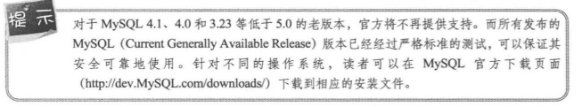

## 数据库
### [1.1 数据库基础](https://github.com/FullStackPark/Knowledge/blob/master/MySQL_basics/MySQL.md#1-%E6%95%B0%E6%8D%AE%E5%BA%93%E5%9F%BA%E7%A1%80)
#### [1.1.1 什么是数据库](https://github.com/FullStackPark/Knowledge/blob/master/MySQL_basics/MySQL.md#11-%E4%BB%80%E4%B9%88%E6%98%AF%E6%95%B0%E6%8D%AE%E5%BA%93)
#### [1.1.2 表](https://github.com/FullStackPark/Knowledge/blob/master/MySQL_basics/MySQL.md#112-%E8%A1%A8-1)
#### [1.1.3 数据类型](https://github.com/FullStackPark/Knowledge/blob/master/MySQL_basics/MySQL.md#113-%E6%95%B0%E6%8D%AE%E7%B1%BB%E5%9E%8B-1)
#### [1.1.4 主键](https://github.com/FullStackPark/Knowledge/blob/master/MySQL_basics/MySQL.md#114-%E4%B8%BB%E9%94%AE-1)
### [1.2 数据库技术构成](https://github.com/FullStackPark/Knowledge/blob/master/MySQL_basics/MySQL.md#12-%E6%95%B0%E6%8D%AE%E5%BA%93%E6%8A%80%E6%9C%AF%E6%9E%84%E6%88%90-1)
#### [1.2.1 数据库系统](https://github.com/FullStackPark/Knowledge/blob/master/MySQL_basics/MySQL.md#121-%E6%95%B0%E6%8D%AE%E5%BA%93%E7%B3%BB%E7%BB%9F-1)
#### [1.2.2 SQL 语言](https://github.com/FullStackPark/Knowledge/blob/master/MySQL_basics/MySQL.md#122-sql-%E8%AF%AD%E8%A8%80-1)
#### [1.2.3 数据库访问接口](https://github.com/FullStackPark/Knowledge/blob/master/MySQL_basics/MySQL.md#123-%E6%95%B0%E6%8D%AE%E5%BA%93%E8%AE%BF%E9%97%AE%E6%8E%A5%E5%8F%A3-1)
### [1.3 什么是MySQL](https://github.com/FullStackPark/Knowledge/blob/master/MySQL_basics/MySQL.md#13-%E4%BB%80%E4%B9%88%E6%98%AFmysql-1)
#### [1.3.1 客户机-服务器软件](https://github.com/FullStackPark/Knowledge/blob/master/MySQL_basics/MySQL.md#131-%E5%AE%A2%E6%88%B7%E6%9C%BA-%E6%9C%8D%E5%8A%A1%E5%99%A8%E8%BD%AF%E4%BB%B6-1)
#### [1.3.2 MySQL 版本](https://github.com/FullStackPark/Knowledge/blob/master/MySQL_basics/MySQL.md#132-mysql-%E7%89%88%E6%9C%AC-1)

### 1. 数据库基础

数据库由一批数据构成的有序的集合,这些数据被存放在结构化的数据表里.数据表之间相互关联,反应了客观事物的本质练习.数据库系统提供对数据的安全控制和完整性控制.本届将介绍数据库中的一些基本概念,包括:数据库的定义和数据类型的定义和数据类型等.

#### 1.1 什么是数据库

数据库的概念诞生于60年前,随着信息技术和市场的快速发展,数据库技术层出不穷,随着应用的拓展和深入,数据库的数量和规模越开越大,其诞生和发展给计算机信息管理带来的一场巨大的革命.数据库的发展大致分为如下几个阶段: 人工管理阶段, 文件系统阶段, 数据库系统阶段,高级数据库阶段.其种类大概有3种:层次式数据库, 网络式数据库和关系式数据库.不同种类的数据库安步彤的数据就够来联系和组织.对于数据库的概念,没有一个完全的定义,随着数据库历史的发展, 定义的内容也很大的差异, 其中一个比较普遍的观点认为, 数据库(DataBase, DB)是一个长期储存在计算机内的, 有组织的, 有共享的, 统一管理的数据集合. 它是一个按数据结构来储存和管理数据的计算机软件系统, 及数据库包含两层含义: 保管数据的 "仓库", 以及数据管理的方法和技术.数据库的特点包括: 实现数据共享, 减少数据冗余: 采用特定的数据类型: 具有较高的的数据独特性: 具有统一的数据控制功能.

#### 1.1.2 表

在关系数据库中, 数据库表示一系列二维数组的集合, 用来存储数据和操作数据的逻辑结构. 它有纵向的列表和横向的行组成, 行被称为记录, 是组织数据的单位: 列被称为字段, 每一个列表表示记录的一个属性, 都有相应的描述信息, 如数据类型,数据宽度等例如一个有关作者信息的名为authors的表中, 每个列表包含所有作者的某个特定类型的信息, 比如"姓名", 而每行则包含了某个特定作者的所有信息: 编号, 姓名, 性别, 专业, 如图 1.1所示

#### 1.1.3 数据类型

数据类型决定了数据在计算机中的存储不同的信息类型, 常用的数据类型有: 整数数据类型浮点数数据类型, 精确小数类型, 二进制数据类型, 日期/时间数据类型, 字符串数据类型表示的每一个字段就是某种指定数据类型 比如图1.1中 "编号"字段为整数数据类型,"性别"字段为字符型数据.

#### 1.1.4 主键
主键(Primary Key)又称主码, 用于唯一地标识表中的每一条记录. 可以定义表中的一列或多列为主键, 主键列上不能有两行相同的值, 也不能为空值. 假如, 定义authors表, 该表给每一个作者分配一个"作者编号", 该编号作为数据表的主键, 如果出现相同的值, 将提示错误, 系统不能确定查询的究竟是哪一条记录:如果把作者的"姓名"作为主键,则不能出现重复的名字, 这与现实不相符合,因此"姓名"字段不适合做为主键.

### 1.2 数据库技术构成
数据库系统由硬件部分和软件部分共同构成, 硬件主要用于储存数据库中的数据,包括计算机, 存储设备等. 软件部分包括DBNMS,支持DBMS运行的操作系统, 以及支持多中语言进行应用开发的访问技术等. 本节将介绍数据库的技术构成.

#### 1.2.1 数据库系统
数据库系统有3个主要的组成部分

  * 数据库: 用于存储数据的地方
  * 数据库管理系统: 用于管理数据库的软件
  * 数据库应用程序: 为了提高数据库系统的处理能力所使用的管理数据库的软件补充

数据库提供了一个存储空间用以存储各种数据, 可以将数据库视为一个存储数据的容器一个数据库可能包含许多文件,一个数据库系统中通常包含许多数据库.数据库管理系统(DataBase Management System,DBMS)是用户创建,管理和维护数据库时所使用的软件,位于用户与操作系统之间, 对于数据库进行统一管理. DBMS能定义数据存储结构, 提供数据的操作机制, 维护数据库的安全性, 完整性和可靠性.虽然已经有了DBMS, 但是在很多情况下,DBMS无法满足对数据管理的要求.数据库应用程序(DataBase Application)的使用可以满足对数据管库的更高要求, 还可以使数据管理更加直观和友好. 数据库应用程序扶着与DBMS进行通信, 访问和管理DBMS中存储的数据,允许用户插入,修改,删除DB中的数据

数据库系统如图1.2所示:

#### 1.2.2 SQL 语言
对数据库进行查询和修改操作的语言叫做SQL. SQL的含义是结构化查询语言(Structured Query Language). SQL 有许多不同的类型, 有3个主要的标准: ANSL (美国国家标准机构) SQL, 对ANSI SQL 修改后在1992年采纳的标准, 成为 SQL-92 或 SQL2.最近的 SQL-99 标准, 从 SQL2 扩充而来增加了对象关系特征和许多其他新功能.其次,各大数据库厂商提供不同版本的 SQL,这些版本的SQL不但能包括原始的 ANSI 标准, 而且在很大程度上支持 SQL-92 标准

    SQL包含以下4个部分.

        (1)  数据定义语言 (DDL): DROP, CREATE, ALTER 等语句
        (2)  数据操作语言 (DML): INSERT(插入), UPDATE(修改), DELETE(删除)语句.
        (3)  数据查询语言 (DQL): SELECT 语句.
        (4)  数据控制语言 (DCL): GRANT, REVOKE, COMMIT, ROLLBACK 等语句.

下面是一条 SQL 语句的例子, 该语句声明创建一个名叫 students 的表:

    CREATE TABLE students
    (
      student_id INT UNSIGNED,
      name VARCHAR(30),
      sex CHAR(1),
      birth DATE,
      PRIMARY KEY (student_id)
      ):

该表包含4个字段, 分别为 student_id, name, sex, birth. 其中 student_id 定义为表的主键.  现在只是定义了一张表格,但并没有任何数据, 接下来这条 SQL 声明语句, 将在 students表中插入一条数据记录:

    INSERT INTO students (student_id, name, sex, birth)
    VALUES (41048101, 'Lucy Green', '1', '1990-02-14');

执行完该 SQL 语句之后, students表中就会增加一行新记录, 该记录制度按 student_id 的值为 41048101, name 制度按的值为 Lucy Green, sex 字段为1 . birth 制度按为 1990-02-14.

在使用 SELECT 查询语句获取刚才插入的数据, 如下:

    SELECT 那么FRON students WHERE student_id = 41048101;
    +-----------------+
    |  name           |
    +-----------------+
    |  Lucy Green     |
    +-----------------+

上面简单举例了常用的数据库操作语句, 在这里为读者一个直观印象, 读者可能还不能理解, 接下来会在学习 MySQL的过程中详细介绍这些知识.

#### 1.2.3 数据库访问接口

不同的程序设计语言会有各自不同的数据库访问接口, 程序语言通过这些接口, 执行 SQL语句, 进行数据库管理. 主要的数据库访问接口有:

1. ODBC

OPEN Database Connectivity (ODBC, 开放数据库互连)技术未访问不同的 SQL 数据库提供了一个共同的接口. ODBC使用SQL作为访问数据库的标准. 这一接口提供了最大限度的互操作性: 一个应用程序可以通过共同的一组代码访问不同的 SQL 数据库管理系统(DBMS). 一个基于ODBC 的应用程序对数据库的操作不依赖何 DBMS.
不直接与DBMS打交道, 所有的数据库作由对应的DBSM 的ODBC驱动程序完成. 也就是说, 不论是Access,MySQL
还是 Oracle 数据库, 均可用 ODBC API进行访问. 由此可见, ODBC的最大优点是能以统一的方式处理所有的数据库.

2. JDBC

Java Data Base Connectivity (JDBC, Java数据库连接) 用于 Java 应用程序链接数据库的标准方法,是一种用于执行SQL语句的Java API , 可以为多种关系数据库提供统一访问, 它由一组 Java语言编写的类和接口组成

3. ADO.NET

ADO.NET是微软在.NET 框架下开发这几的一组用于和数据库进行交互的面向对象库类. ADO.NET提供了对关系数据,XML 和应用程序数据的访问, 允许和不同类型的石聚缘以及数据库进行交互.

4. PDO

PDO (PHP Data Object) 为 PHP访问数据库定义了一个轻量级的,一致性的接口, 他提供了一个数据访问抽象层,这样, 无论使用什么数据库,都可以通过一致的函数实行沙勋和获取数据. PDO 是PHP5 新加入的一个重大功能, 针对不同的程序语言, MySQL提供了不同数据库的访问链接驱动, 读者可以在下载页面(http://dev.MySQL.com/downloads/) 下载相关驱动.

### 1.3 什么是MySQL

MySQL 是一个小型关系数据库管理系统, 与替他大型数据库管理系统(例如 Oracle,DB2, SQL Server等) 相比, MySQL 规模小, 功能有限, 但是它体积小, 速度快, 成本低, 切它提供的功能对稍微复杂的应用来说已经够用, 这些特性是的 MySQL成为世界上最受欢迎的开放源代码数据库, 本节将介绍MySQL的特点

#### 1.3.1 客户机-服务器软件

主从式架构(Client-server moldel)或客户端-服务器(Client/server)结构简称 C/S结构,是一种网络架构, 通常再该网络架构下软件分为客户端(Client)和服务器(Server). 服务器是整个应用系统资源的存储与管理中心, 多个客户端则各自处理相应的功能, 共同实现完整的应用. 在客户/服务器结构中, 客户端用户的请求被传送到数据库服务器,数据库服务进行处理后, 将结果返回给用户, 从而减少了网络书记传输量. 用户使用应用程序时, 首先启动客户端, 通过有关命令告知服务器进行连接已完成各种操作, 而服务器则按照此请求提供相应的服务. 每一个客户端软件的实例都可以想一个服务器或应用程序服务器发出请求. 这种系统的特点就是. 客户端和服务器程序不在同一台计算机上运行, 这些客户端和服务器程序同常归属不同的计算机.  主从架构通过不同的途径应用于很多不同类型的应用程序. 比如. 现在人们最熟悉的在因特网上使用的网页, 例如 当顾客想要在当当网站上买书的时候, 电脑和网页浏览器就被当作一个客户端, 同时,组成当当网的电脑,数据库 和应用程序就被当作服务器, 当顾客的网页浏览器向当当网请求搜寻数据库相关的图书时 ,当当网服务器从当当网的数据库中合成一个网页, 再发送回顾客的就蓝旗, 服务器端一般使用高性能的计算机, 并配合使用不同类型的数据库, 比如Oracle, Sybase,或者是MySQL等 客户端需要安装专门的软件 比如专门开发的客户端工具浏览器等.

#### 1.3.2 MySQL 版本

    针对不同用户, MySQL分别为两个不同的版本:

*  MySQL Community Server(社区版): 改版本完全免费, 但是官方不提供技术支持.
*  MySQL Enterprise Server(企业版服务器): 它能够以很高的性价比为企业提供数据库仓库应用, 支持ACID事物处理,提供完整的提交,回滚,崩溃恢复和行级锁定功能,但是该版本需要付费使用, 官方提供电话技术支持. MySQL的命名机制有3个数字和一个后缀组成, 例如: MySQL-5.7.10.

(1) 第1个数字(5)是主版本号,描述了文本格式,所有版本 5 的发行版都有相同的文件格式

(2) 第2个数字(7)是发行级别, 主版本号和发行级别组合在一起便构成了发行序列号

(3) 第3个数字(10)是在此发行系列的版本号,随每次新分发行版本递增. 通常选择已经发行的最新版本.

在MySQL开发过程中, 同时存在多个发布系列, 每个发布处在成熟的不同阶段.

(1) MySQL 5.7 是最新开发的稳定(GA)发布系列, 是将执行新功能的系列,目前已经可以正常使用.

(2) MySQL 5.6 是比较稳定(GA)发布新系列. 只针对漏洞修复重新发布, 没有增加会影响稳定的新功能

(3) MySQL 5.1 是前一稳定(产品质量)发布系列. 只针对严重漏洞修复和安全修复重新发布,没有增加会影响该系列凡人重要功能.

#### 1.3.3 MySQL 的优势

    MySQL的主要优势如下:
      (1) 速度: 运行速度快.
      (2) 价格: MySQL对多数个人来说是免费的.
      (3) 容易使用: 与其他大型数据库的设置和管理相比, 其复杂程度较低, 易于学习.
      (4) 可移植性: 能够工作在众多不同的系统平台上,例如: Windows, Linux, Unix, Mac OS 等.
      (5) 丰富的接口: 提供了用于 C, C++, Eiffel, Java, Perl, PHP, Python, Ruby 和 Tcl 等语言的 API.
      (6) 支持查询语言: MySQL 可以利用标准SQL语法和支持ODBC(开放式数据库连接)的应用程序.
      (7) 安全性和连接性: 十分灵活和安全的权限的密码系统, 允许基于主机的验证.链接到服务器时, 所有的密码传均采用家吗形式, 从而保证可密码安全. 并且由于 MySQL是网络化的, 因此可以在因特网上的任何地方访问, 提高数据共享的效率.
      
