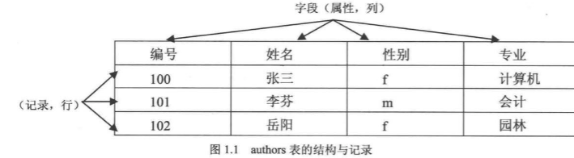
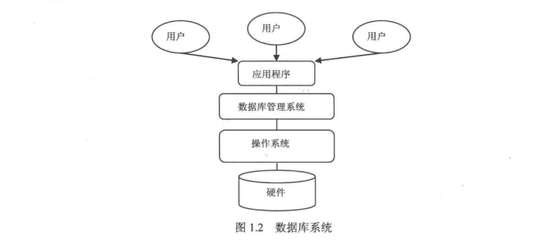

## 数据库
### [1.1数据库基础]()
#### [1.1.1什么是数据库]()
#### [1.1.2表]()
#### [1.1.3数据表]()
#### [1.1.4主键]()
### [1.2数据库技术构成]()
#### [1.2.1数据库系统]()

### 1. 数据库基础

数据库由一批数据构成的有序的集合,这些数据被存放在结构化的数据表里.数据表之间相互关联,反应了客观事物的本质练习.数据库系统提供对数据的安全控制和完整性控制.本届将介绍数据库中的一些基本概念,包括:数据库的定义和数据类型的定义和数据类型等.

#### 1.1 什么是数据库

数据库的概念诞生于60年前,随着信息技术和市场的快速发展,数据库技术层出不穷,随着应用的拓展和深入,数据库的数量和规模越开越大,其诞生和发展给计算机信息管理带来的一场巨大的革命.数据库的发展大致分为如下几个阶段: 人工管理阶段, 文件系统阶段, 数据库系统阶段,高级数据库阶段.其种类大概有3种:层次式数据库, 网络式数据库和关系式数据库.不同种类的数据库安步彤的数据就够来联系和组织.对于数据库的概念,没有一个完全的定义,随着数据库历史的发展, 定义的内容也很大的差异, 其中一个比较普遍的观点认为, 数据库(DataBase, DB)是一个长期储存在计算机内的, 有组织的, 有共享的, 统一管理的数据集合. 它是一个按数据结构来储存和管理数据的计算机软件系统, 及数据库包含两层含义: 保管数据的 "仓库", 以及数据管理的方法和技术.数据库的特点包括: 实现数据共享, 减少数据冗余: 采用特定的数据类型: 具有较高的的数据独特性: 具有统一的数据控制功能.

#### 1.1.2 表

在关系数据库中, 数据库表示一系列二维数组的集合, 用来存储数据和操作数据的逻辑结构. 它有纵向的列表和横向的行组成, 行被称为记录, 是组织数据的单位: 列被称为字段, 每一个列表表示记录的一个属性, 都有相应的描述信息, 如数据类型,数据宽度等例如一个有关作者信息的名为authors的表中, 每个列表包含所有作者的某个特定类型的信息, 比如"姓名", 而每行则包含了某个特定作者的所有信息: 编号, 姓名, 性别, 专业, 如图

#### 1.1.3 数据类型

数据类型决定了数据在计算机中的存储不同的信息类型, 常用的数据类型有: 整数数据类型浮点数数据类型, 精确小数类型, 二进制数据类型, 日期/时间数据类型, 字符串数据类型表示的每一个字段就是某种指定数据类型 比如图1.1中 "编号"字段为整数数据类型,"性别"字段为字符型数据.

#### 1.1.4 主键
主键(Primary Key)又称主码, 用于唯一地标识表中的每一条记录. 可以定义表中的一列或多列为主键, 主键列上不能有两行相同的值, 也不能为空值. 假如, 定义authors表, 该表给每一个作者分配一个"作者编号", 该编号作为数据表的主键, 如果出现相同的值, 将提示错误, 系统不能确定查询的究竟是哪一条记录:如果把作者的"姓名"作为主键,则不能出现重复的名字, 这与现实不相符合,因此"姓名"字段不适合做为主键.

### 1.2 数据库技术构成
数据库系统由硬件部分和软件部分共同构成, 硬件主要用于储存数据库中的数据,包括计算机, 存储设备等. 软件部分包括DBNMS,支持DBMS运行的操作系统, 以及支持多中语言进行应用开发的访问技术等. 本节将介绍数据库的技术构成.

#### 1.2.1 数据库系统
数据库系统有3个主要的组成部分

  * 数据库: 用于存储数据的地方
  * 数据库管理系统: 用于管理数据库的软件
  * 数据库应用程序: 为了提高数据库系统的处理能力所使用的管理数据库的软件补充

数据库提供了一个存储空间用以存储各种数据, 可以将数据库视为一个存储数据的容器一个数据库可能包含许多文件,一个数据库系统中通常包含许多数据库.数据库管理系统(DataBase Management System,DBMS)是用户创建,管理和维护数据库时所使用的软件,位于用户与操作系统之间, 对于数据库进行统一管理. DBMS能定义数据存储结构, 提供数据的操作机制, 维护数据库的安全性, 完整性和可靠性.虽然已经有了DBMS, 但是在很多情况下,DBMS无法满足对数据管理的要求.数据库应用程序(DataBase Application)的使用可以满足对数据管库的更高要求, 还可以使数据管理更加直观和友好. 数据库应用程序扶着与DBMS进行通信, 访问和管理DBMS中存储的数据,允许用户插入,修改,删除DB中的数据

数据库系统如图1.2所示:

