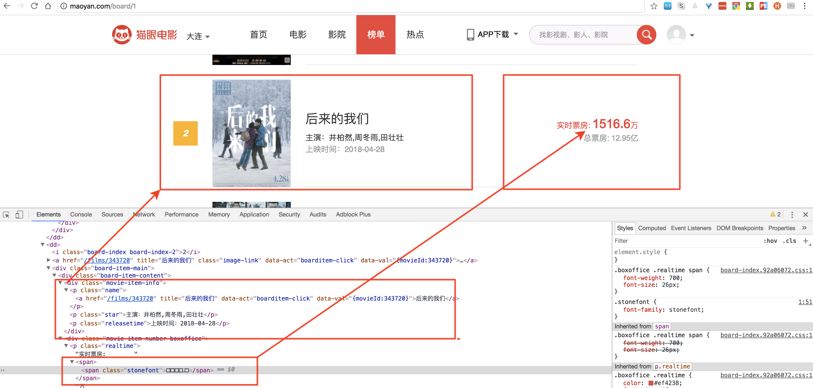
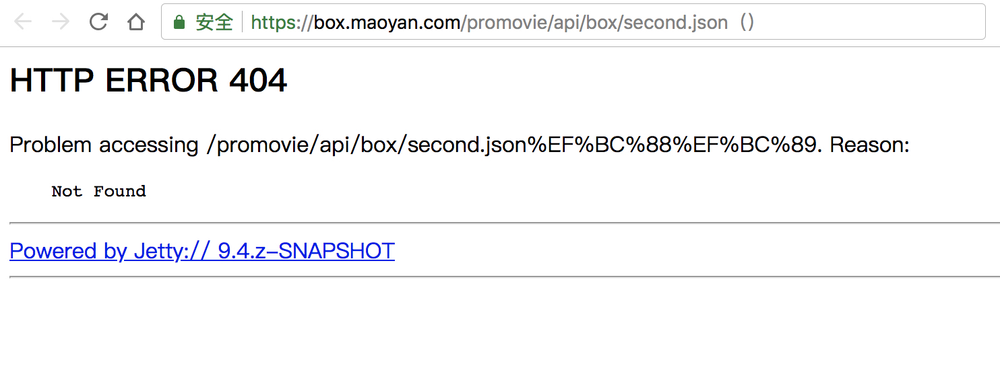

# 猫眼爬虫

## 01.常见反爬虫机制

### 1.通过Headers反爬虫

Headers就像寄快递填的那个单子，这些信息与正文无关，却关系着通信能否成功。以下图为例，当我访问自己的知乎主页时，消息头就包括：

消息头      | 简介                                     
-------- | ---------------------------------------
**请求网址** | 我们与之互动通信的网络地址                          
**请求方法** | GET指从这个网址获取内容，而输入用户名密码登录网站则是POST方法     
**远程地址** | 115.159.241.95是知乎的服务器IP，443是SSL加密通信的端口号
**状态码**  | 200表示OK，另一个很有名的状态码是404 Not Found       

简略的消息头

当然消息头远不止这些内容，还包括你的操作系统型号、浏览器型号、语言、cookie等。多年以前还有人专门做个网页，搞得好像算命似的来“猜”你的电脑有什么信息，其实都是浏览器悄悄地出卖了你。

详细的消息头

如果直接调用Python的urllib等扩展包，也可以发起网络请求，但是默认的Headers信息也会诚实地显示出来。目标网站受到带有Headers信息的请求，就可以知道请求的发起方是人是鬼还是爬虫。

这是最基础的一种反爬虫机制，破解也很简单，只要在发起请求时伪造Headers，装的像个人就行了。

### 2.基于用户行为反爬虫

有时候网络状况不好，点击一个按钮没有反应，我们就会连续点击很多次，然后网站弹出个对话框说“您在短时间内执行了太多相同操作”，并暂时封禁了这一行为。

人类的手工操作上限是很低的，高桥名人每秒也不过17次，专业电竞选手APM也只有几百，而爬虫程序则可以高出几个数量级，这会给服务器带来很大负担。

除了操作频率以外，真正的人类和程序还有很多行为模式上的差别，很多网站都会采取机器学习算法来鉴别请求的发起方是否为正常人。

破解手段也是很多样的，比如建立“IP池”，把大量的请求分散到不同的IP地址来源上，这样看起来好像是很多用户在短时间内自然操作的。

### 3.其他手段

爬虫与反爬虫之间的消长已有几十年历史，发展出的技术理念和手段纷繁多样，如通过AJAX、JS脚本等方式动态产生网页元素。应对这些反爬虫技术，我的习惯是使用自动化测试框架Selenium，驱动浏览器内核，完全模拟用户行为，也就是“不是爬虫的爬虫”，所谓手中无虫、心中有虫也。

在实际应用中，不论爬虫还是反爬虫，都是多种方式结合起来的。

## 02.猫眼的反爬虫机制

打开浏览器控制台可以发现，票房数据其实是加密过的生僻unicode编码，而且每次访问获得的unicode是随机生成的。也就是说，明文攻击只对单次访问有效。

### 1. 有乱码的情况

而前端的阅读是正常的，这是因为猫眼使用了来自美团的特殊字体，把密文编码对应的字符，通过样式表渲染成为数字，这其实就是一个解密的过程。

[再看几年前的例子](https://github.com/HiddenStrawberry/meituan-movie-price-crawler)

破解这种机制，大致上有两个方向：

密码学破译： 采集足量的明文-密文对照样本，挖掘映射关系。

模式识别： 绕过加密系统，从图像中“读”出数字。

密文的unicode编码位数不多，破解的难度不大。但是问题在于，就像上面提到过的，反爬虫技术也是综合了多种方式，要高频、大量地采集数据，很有可能触发其他防御手段。

意外收获

### 2. API地址

http://piaofang.maoyan.com/history/date/box.json

https://box.maoyan.com/promovie/api/box/second.json（http://piaofang.maoyan.com/dashboard?movieId=248170）

3. 

